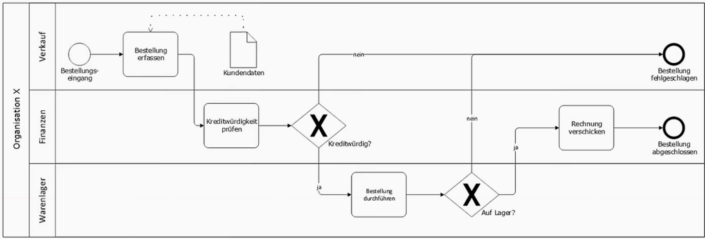
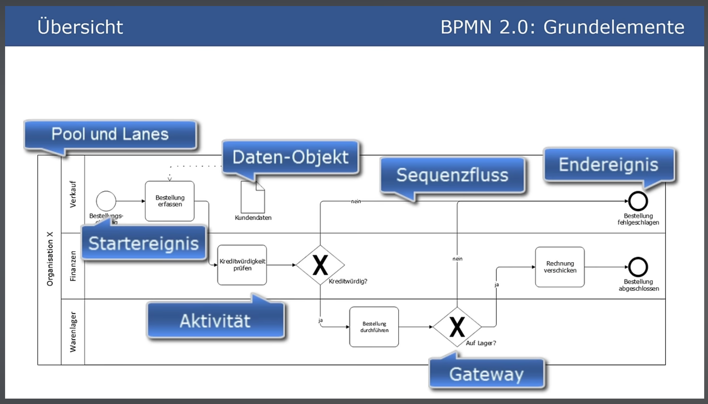

# BPMN - Business Process Model and Notation

Für die Darstellung von Geschäftsprozessen

## Ereignisse 
Ereignisse sind immer rund
- Start-Ereignis (Dünne Linie)
- Zwischen-Ereignis (Doppelte Linie)
- End-Ereignis (Dicke Linie)

## Aktivitäten
[Aktivitäten](../Begriffe/Aktivitäten.md) 
sind immer rechteckig mit abgerundeten Ecken
Einzelne Aufgaben innerhalb eines Prozesses

## Sequenzflüsse
Sequenzflüsse sind immer Pfeillinien

## Gateways
[Gateways](../Begriffe/Gateways.md) sind immer Rauten
- Exklusives Gateway (XOR)
- Paralleles Gateway (AND)
- Inklusives Gateway (OR)

## Datenobjekte
Kundendaten, Emails, Dokumente, etc. innerhalb des Prozesses

## Pools und Lanes
**Organisation X**
Pools:  Organisationen oder Rollen

Lanes:  Abteilungen oder Teams innerhalb der Organisation
Nicht genauer definiert

