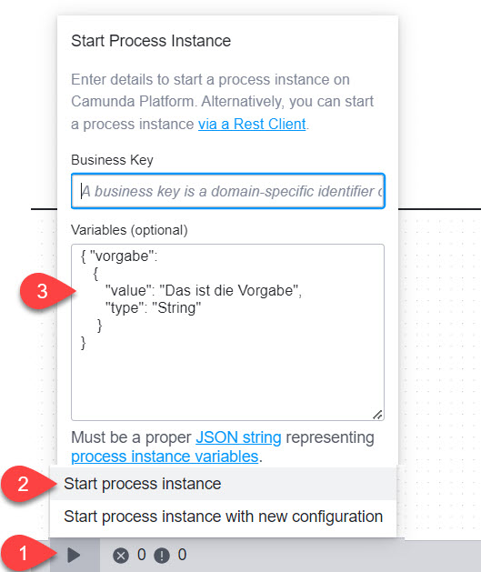

# Externen Task einbinden - Basis
-------------------------------

## Aufgabenstellung

Was bei einem bestimmten Task zu tun ist, soll in einem Python-Skript definiert werden. Anstelle dass also Camunda die Abarbeitung eines Tasks übernimmt, soll ein Python-Skript die Verarbeitung übernehmen.

## Angaben zur Lösung

**Voraussetzung**

- Python muss installiert sein
- "camunda-external-task-client-python3" muss installiert sein:

``` cmd
pip install camunda-external-task-client-python3
```


**Vorgehen**

1) BPMN deployen
2) Python-Skript starten (auf dem lokalen Host, also ausserhalb des Camunda-Containers)
3) Prozess starten (bspw. in Tasklist oder direkt aus dem Camunda Modeler)

Dem Prozess kann beim Aufruf eine Variable "vorgabe" übergeben werden. Der mitgegebene Wert wird dann im Python-Skript ausgegeben:
)

Beim Start kann folgendes JSON-Fragment mitgegeben werden:
``` json
{
    "vorgabe": 
    {
        "value": "Irgendein Wert",
        "type": "String"
    }
}
```

## Konfigurationsoptionen

Im Python-Skript wird eine Variable **default_config** verwendet. 
Die Bedeutung der Optionen finden Sie [hier](../Aufg_ExternalTask/PythonConfigOptions.md) beschrieben.