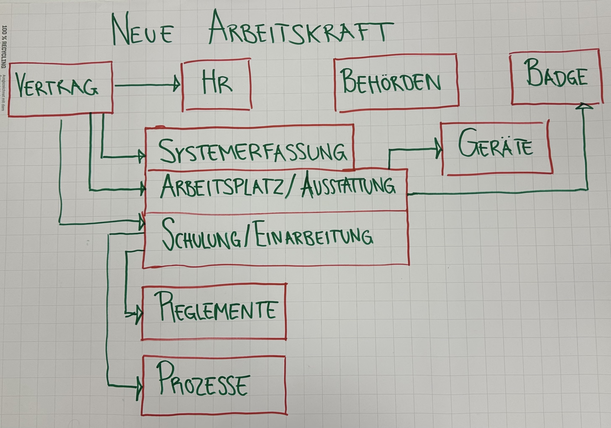

# 254 - Geschäftsprozesse im eigenen Berufsumfeld beschreiben

- Trigger
- Input
- Output
- Ziel

## Geschäftsprozess darstellen 
## Neue Arbeitskraft anstellen

- Vertrag unterschrieben
- Vertrag an zuständige Stelle senden
- Personalien erfassen
- Arbeitsplatz bereitstellen
- Ausstattung bereitstellen (Badge, Laptop, Handy)
- Schulung(interne Systeme, Prozesse)
- Systemerfassung (HR, IT)
- Führung durch die ersten Tage
- Einarbeitung
